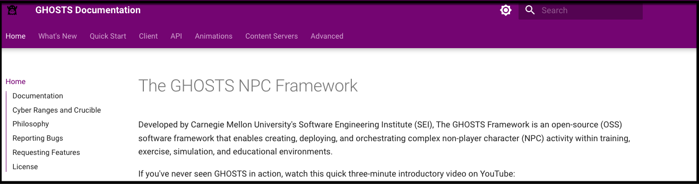

# GHOSTS Security Playground



## Overview

GHOSTS Security Playground is a terraform template creating a lab implementation of the [GHOSTS NPC User simulation framework](https://cmu-sei.github.io/GHOSTS/) created by Carnegie Mellon University.  Additionally, it builds some customizable capabilities for an AD pentest lab or Detection Engineering.  It builds the following resources hosted in AWS:

* GHOSTS version 8.0 server with API and Grafana dashboards pre-loaded
* One Active Directory Domain Controller loaded with 1,000 AD users, groups, and OUs
* One Elastic server with Kibana
* One Windows Client (Windows Server 2022) with automated deployment of the following:
  - GHOSTS version 8.0 client with customizable timeline and app configuration
  - Atomic Red Team (ART) and  PurpleSharp
  - Sysmon with customizable config
  - Automatically ships logs to Elastic via Winlogbeat client
  - Active Directory Domain Joined

See the **Details** section for more information.

## Requirements and Setup

**Tested with:**

* Mac OS 13.4 or Ubuntu 22.04
* terraform 1.5.7

**Clone this repository:**
```
git clone https://github.com/iknowjason/GHOSTSPlayground
```

**Credentials Setup:**

Generate an IAM programmatic access key that has permissions to build resources in your AWS account.  Setup your .env to load these environment variables.  You can also use the direnv tool to hook into your shell and populate the .envrc.  Should look something like this in your .env or .envrc:

```
export AWS_ACCESS_KEY_ID="VALUE"
export AWS_SECRET_ACCESS_KEY="VALUE"
```

## Build and Destroy Resources

### Run terraform init
Change into the ```GHOSTSPlayground/code``` working directory and type:

```
terraform init
```

### Run terraform plan or apply
```
terraform apply -auto-approve
```
or
```
terraform plan -out=run.plan
terraform apply run.plan
```

### Destroy resources
```
terraform destroy -auto-approve
```

### View terraform created resources
The lab has been created with important terraform outputs showing services, endpoints, IP addresses, and credentials.  To view them:
```
terraform output
```

## Estimated Cost (Just a Guess)

As this tool spins up cloud resources, it will result in charges to your AWS account. Efforts have been made to minimize the costs incurred and research the best options for most uses cases. The best way to use this is reference the estimated cost below, check your AWS costs daily, and verify them against this information included below. Be sure to tear down all resources when not using them.  See the ```AWS Pricing Calculator```:

https://calculator.aws/#/

| System       | Instance  | Hourly Cost  | Default Region |
| ------------- |:-------------:|:-------:|:-------:|
|  GHOSTS     | t3a.medium | $0.0376   | us-east-2 |
|  Elastic    | t2.xlarge | $0.1856   | us-east-2 |
|  DC         | t2.small |  $0.023  | us-east-2 |
|  Win Client | t3a.medium |  $0.0376   | us-east-2 |

**Note:**  A couple of the systems use larger EBS volumes for data storage.  You can see the EBS pricing estimator to get exact prices:

https://aws.amazon.com/ebs/pricing/

GHOSTS system uses a gp2 volume of 96 GB which calculates to $0.10 per GB-month of provisioned storage or $9.6 per month.  Seems to be calculated hourly.

The Elastic Search system uses a gp2 volume of 100 GB which calculates to $0.10 per GB-month of provisioned storage or $10 per month.

The DC system uses a gp2 volume of 90 GB which calculates to $0.10 per GB-month of provisioned storage or $9 per month.  Seems to be calculated hourly.

## Details

### Important Firewall and White Listing
By default when you run terraform apply, the security group is wide open to the public Internet allowing ```0.0.0.0/0```.  To lock this down:  your public IPv4 address can be determined via a query to ifconfig.so and the ```terraform.tfstate``` is updated automatically.  If your location changes, simply run ```terraform apply``` to update the security groups with your new public IPv4 address.  If ifconfig.me returns a public IPv6 address,  your terraform will break.  In that case you'll have to customize the white list.  To change the white list for custom rules, update this variable in ```sg.tf```:
```
locals {
  #src_ip = "${chomp(data.http.firewall_allowed.response_body)}/32"
  src_ip = "0.0.0.0/0"
}
```

### GHOSTS Linux Server

GHOSTS Linux server is built on an Ubuntu Linux 22.04 AMI automatically using ```user-data``` feature of AWS to bootstrap the services.  The following local project files are important for customization:

| File        | Description  | Output  |
| ------------- |:-------------:|:-------:|
| code/ghosts.tf      | The terraform file that builds the Linux server |    |
| code/files/ghosts/bootstrap.sh.tpl | The main bootstrap script. | code/output/ghosts/bootstrap.sh |
| code/files/ghosts/dashboards.yml      | grafana dashboards config      |   |
| code/files/ghosts/datasources.yml.tpl | grafana config for datasources. | code/output/ghosts/datasources.yml      |
| code/files/ghosts/docker-compose.yml |   ghosts docker compose    |    |
| code/files/ghosts/npc.sh  |  a script loaded onto the server for localhost api commands |    |
| code/files/ghosts/npc-ext.sh.tpl |   a script to run api commands remotely.  | code/output/ghosts/npc-ext.sh |
| code/s3-ghosts.tf | Uploads some of the ghosts linux files to s3 bucket |   |

**Troubleshooting GHOSTS Linux Server:**

SSH into the GHOSTS server by looking in ```terraform output``` for this line:  
```
SSH to GHOSTS
--------------
ssh -i ssh_key.pem ubuntu@3.128.120.18
```
Once in the system, tail the user-data logfile.  You will see the steps from the ```code/files/ghosts/bootstrap.sh.tpl``` script running:
```
tail -f /var/log/user-data.log
```

**Customize GHOSTS Linux Server:**

To customize GHOSTS, you can modify the linux bootstrap script variables, instance size, security groups and other details in ```ghosts.tf```.  

**Teraform Output:**

View the terraform outputs for important GHOSTS Linux access information:
```
GHOSTS Grafana Console:
----------------
http://ec2-3-15-227-53.us-east-2.compute.amazonaws.com:3000

GHOSTS Grafana Credentials:
--------------------
admin:admin

GHOSTS API Server
-----------------
http://ec2-3-15-227-53.us-east-2.compute.amazonaws.com:5000

SSH to GHOSTS
--------------
ssh -i ssh_key.pem ubuntu@3.15.227.53
```

### Elastic Search Linux Server

As of July 2024, this automatically deploys a docker deployment of Elastic 8.9.1.  The Elastic Search Linux server system includes Kibana and is built on an Ubuntu Linux 22.04 AMI automatically using ```user-data``` feature of AWS to bootstrap the services.  The following local project files are important for customization:

| File        | Description  | Output  |
| ------------- |:-------------:|:-------:|
| code/elastic.tf      | The terraform file that builds the Linux server |  |
| code/files/elastic/bootstrap.sh.tpl | The bootstrap script. | code/output/elastic/bootstrap.sh |
| code/files/elastic/elasticsearch.yml.tpl | elasticsearch server config.  | code/output/elastic/elasticsearch.yml      |
| code/files/elastic/kibana.yml.tpl  |  kibana server config.  | code/output/elastic/kibana.yml |
| code/files/elastic/logstash.conf.tpl |   logstash server config.  | code/output/elastic/logstash.conf |
| code/files/elastic/elasticsearch.service      | service for elasticsearch      |
| code/files/elastic/kibana.service |   service for kibana    |   |
| code/files/elastic/logstash.service  | service for logstash  |   |

**Troubleshooting Elastic Linux Server:**

SSH into the Elastic server by looking in ```terraform output``` for this line:  
```
SSH to Kibana
-------------
ssh -i ssh_key.pem ubuntu@3.15.19.102
```
Once in the system, tail the user-data logfile.  You will see the steps from the ```code/files/ghosts/bootstrap.sh.tpl``` script running:
```
tail -f /var/log/user-data.log
```

**Customize Elastic Linux Server:**

To customize the Elastic Search Linux server, you can modify the linux bootstrap script variables, instance size, security groups and other details in ```elastic.tf```.  You can modify the elastic username (elastic_username) and password (elastic_password) variables.

**Teraform Output:**

View the terraform outputs for important credentials and endpoint for Kibana access information:
```
-------
Kibana Console
-------
https://ec2-3-15-19-102.us-east-2.compute.amazonaws.com:5601
username: elastic
password: Elastic2024

SSH to Kibana
-------------
ssh -i ssh_key.pem ubuntu@3.15.19.102
```

### Windows Server:  Active Directory Domain Controller (DC)

A Windows Server 2022 AMI is built using an Amazon owned image.   Active Directory Domain Services is installed with a forest using ```user-data``` feature of AWS to bootstrap the services using powershell.  An CSV file is uploaded to S3 and then a special bootstrap script downloads the CSV file and imports in all AD users.  The following local project files are important for customization:

| File        | Description  | Output  |
| ------------- |:-------------:|:-------:|
| code/dc.tf      | The terraform file that builds the DC |  |
| code/files/dc/ad_install.ps1.tpl | The powershell script that installs AD DS and Forest. | code/output/dc/ad_install.ps1 |
| code/files/dc/bootstrap-dc.ps1.tpl | The main powershell script for the DC that bootstraps.  | code/output/dc/bootstrap-dc1.ps1    |
| code/ad_users.csv | The list of Active Directory users in CSV   |  |

**Troubleshooting Windows DC:**

The DC local bootstrap script is located in ```code/files/dc/bootstrap-dc.ps1.tpl```.  RDP into the Windows system and follow this logfile to see how the system is bootstrapping.  This main script downloads and executes the ```ad_install.ps1``` script:

```
C:\Terraform\bootstrap_log.log
```

The Active Directory and forest installation follows from ```code/files/dc/ad_install.ps1.tpl```.  Follow this logfile to see how the AD Domain is building:

```
C:\Terraform\ad_install.log
```

The script checks to make sure the forest has been installed with the correct input domain.  If correct, it downloads the ```ad_users.csv``` file from the S3 bucket and loads the AD objects, including AD users, Groups, and OUs.

**Customize Windows DC Server:**

To customize DC, you can modify the AD domain, local Adminstrator username/password, WinRM username/password, the AMI instance and size in ```dc.tf```.  The ```ad_users.csv``` file includes all Domain users, groups, and OUs that attempt to get loaded into AD. 

**Teraform Output:**

View the terraform outputs for important Windows AD Domain and machine access information:
```
-------------------------
Domain Controller and AD Details
-------------------------
Instance ID:            i-01fde1663cbafecd9
Computer Name:          dc
Private IP:             10.100.10.4
Public IP:              18.189.21.74
local Admin:            OpsAdmin
local password:         Tegan-pepper-826627
Domain:                 rtc.local
Domain Admin Username:  jasonlindqvist
Domain Admin Password:  Rue-biggie-619140
```

### Windows Client

The Windows Client system is built from ```win1.tf```.  Windows Server 2022 Datacenter edition is currently used.  You can upload your own AMI image and change the data reference in win1.tf.  The local bootstrap script is located in ```files/windows/bootstrap-win.ps1.tpl```.  RDP into the Windows system and follow this logfile to see how the system is bootstrapping:

```
C:\Terraform\bootstrap_log.log
```

**Customizing Build Scripts**

For adding new scripts for a customized deployment, reference the arrays in ```scripts.tf``` and ```s3.tf```.  For more complex deployments, the Windows system is built to have flexibility for adding customized scripts for post-deployment configuration management.  This gets around the size limit of user-data not exceeding 16KB in size.  The s3 bucket is used for staging to upload and download scripts, files, and any artifacts needed.  How this is done:  A small master script is always deployed via user-data.  This script has instructions to download additional scripts.  This is under your control and is configured in ```scripts.tf``` and ```s3.tf```.  In ```scripts.tf```, take a look at the array called ```templatefiles```.  Add any custom terraform templatefiles here and then add them locally to ```files/windows```.  See the ```red.ps1.tpl``` and ```sysmon.ps1.tpl``` files as an example.  The file should end in ```tpl```.  This template file is generated as output into the directory called ```output```.  The terraform code strips off the ```.tpl``` in the filename when it generates into the ```output``` directory.  Make sure the filename is correct because the master script downloads based on this name.  In ```s3.tf```, each little script referenced in ```templatefiles``` is uploaded.  The master bootstrap script has a reference to this array.  It will automatically download all generated scripts from the ```templatefiles``` array and execute each script.

**GHOSTS on Windows Client:**

The Caldera sandcat agent is automatically installed and launches on the Windows client system.  The bootstrap script waits until Caldera is up and available, then installs Sandcat caldera agent.  It should look like this.

To troubleshoot this, look in the following logfile on the Windows system:  
```
C:\Terraform\caldera_log.log
```

To modify this file locally, it is located in ```files\windows\caldera.ps1.tpl```


**Terraform Outputs**

See the output from ```terraform output``` to get the IP address and credentials for RDP:
```
-------------------------
Virtual Machine - win1
-------------------------
Instance ID:    i-09499cb3e4f5965ab
Computer Name:  win1
Private IP:     10.100.20.10
Public IP:      3.17.14.145
local Admin:    OpsAdmin
local password: Tegan-pepper-826627
------------------------------------------
AFTER DOMAIN JOIN, starts GHOSTS on win1
------------------------------------------
Step 1:  RDP in with credentials to 3.17.14.145
User: RTC\oliviaodinsdottir
Pass: Esther-daisy-906270
Step 2:  Run cmd.exe as Administrator and start ghosts.exe
cd C:\Tools\ghosts\ghosts-client-x64-v8.0.0 (Elevated cmd.exe)
.\ghosts.exe
```

### Red Tools

On the Windows Client system, the following tools are automatically deployed into ```C:\Tools\```:

* Atomic Red Team (ART)
* PurpleSharp

The local bootstrap script for customization is ```files\windows\red.ps1.tpl```

To track monitoring of the deployment on the Windows Client, see the logfile at ```C:\Terraform\red_log.log```

### Blue Tools

Sysmon service and customized configuration (SwiftOnSecurity) is deployed onto the Windows Client system.  To update the sysmon version and configuration, make changes inside the ```files\sysmon``` directory.

The local bootstrap script for customization is ```files\windows\sysmon.ps1.tpl```

To track monitoring of the deployment on the Windows Client, see the logfile at ```C:\Terraform\blue_log.log```

### Future

This terraform was automatically generated by the Operator Lab tool.  To get future releases of the tool, follow twitter.com/securitypuck.

For an Azure version of this tool, check out PurpleCloud (https://www.purplecloud.network)

<a href="https://twitter.com/intent/user?screen_name=securitypuck"></a>


