# Example Images

### GHOSTS API Server after boot 
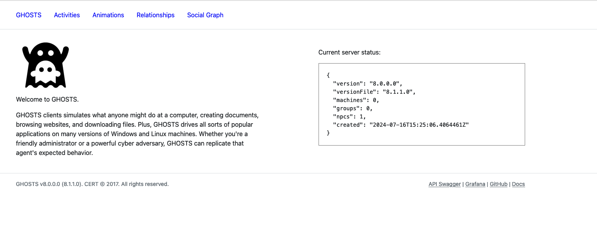

### GHOSTS Grafana Dashboard after boot
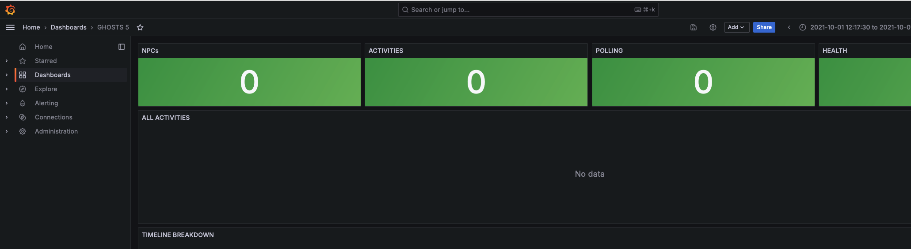

### On Win1 Client, monitoring the bootstrap powershell script logfile
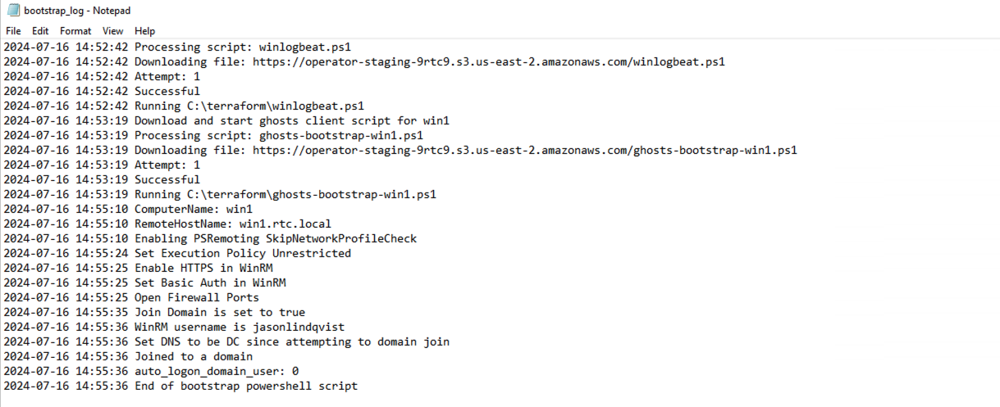

### Run the npc.sh script to sync a new NPC with registered GHOSTS machines
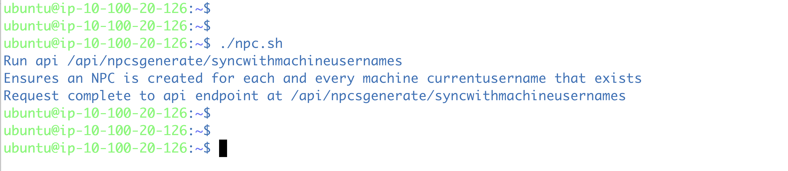

### Description 5
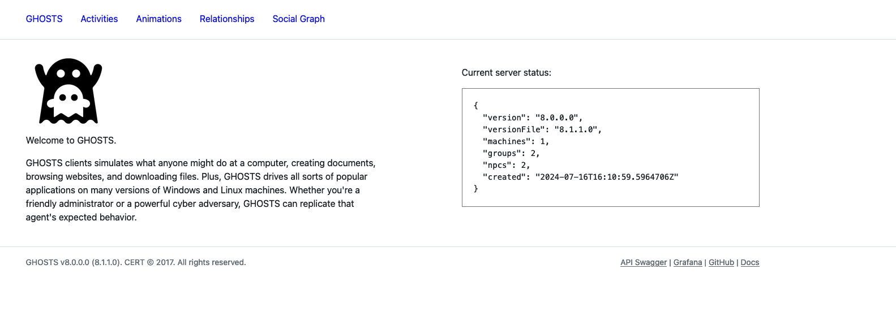

### Description 6
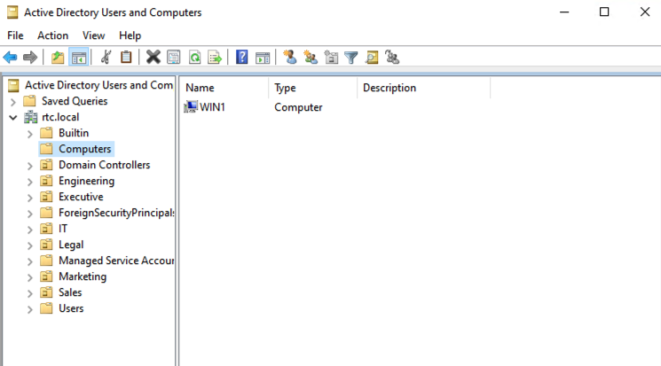

### Description 7
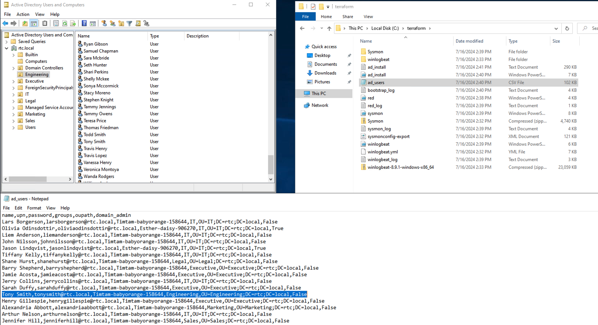

### Description 8
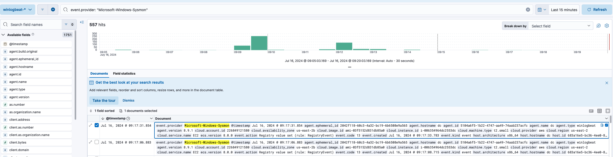

### Description 9
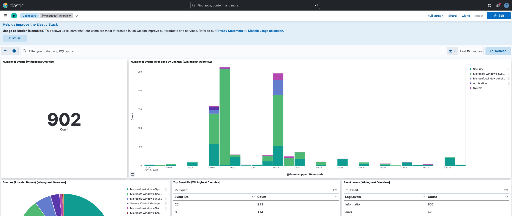

### Description 10
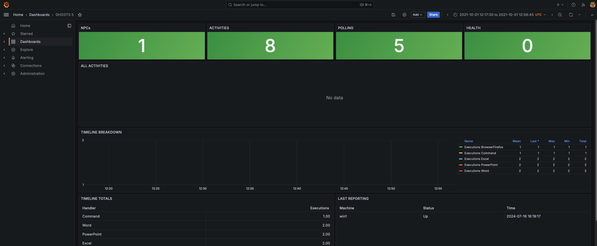

### Description 11
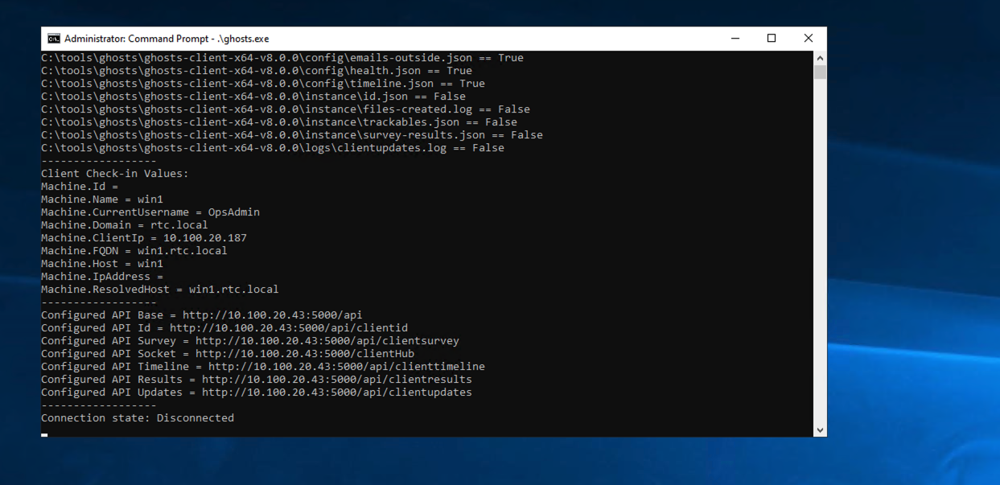

### Description 12
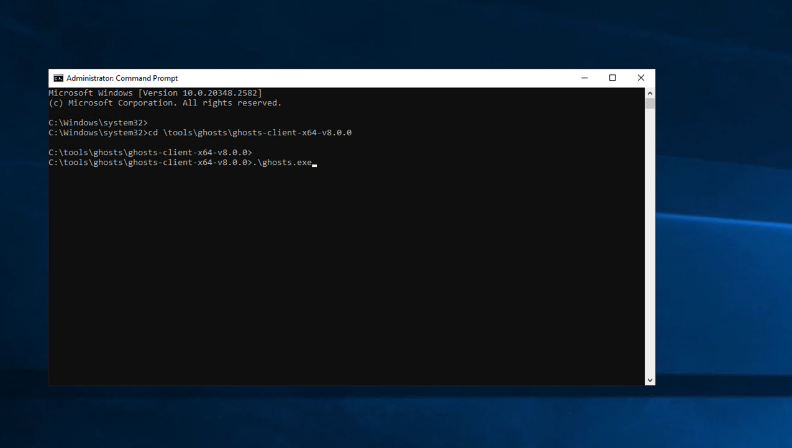

